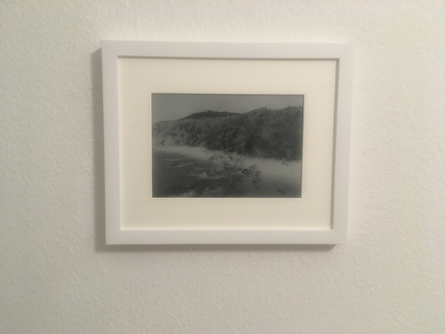

# A year in pictures

This is a project for a year round changing picture.

## Just Why?
Do you like pictures? Yes So do I. Today we snap a picture at every corner. 
Rarely do we look at these pictures again. Pictures are like the rubbish we leave behind. Digital waste.

Modern software services have made a great effort to show us our pictures again. 
Today every phone features some sort of automatic collection. These collections can be watched on demand or sometimes they even suprise us.

But we need to take our phones and look at the pictures, show the pictures to somebody else. 
The pictures change quickly and every single picture is drowned in a sea of pictures.
You rarely have the chance to remember youself, how it was back at this spot at the beach.

I want to bring some of that magic bag. Stick the picture to the wall.
Instead of having the same photo for weeks, months, if not years. My picture should change daily.
I want to get a reminder of a nice moment every day.

## Setup

The hardware is an inkplate epaper mounted in a picture frame.

The software loads pictures from the sd card and displays one picture a time. 
After display it sends the esp32 to sleep to be easy on the attached battery.

## How to convert pictures with gimp

The [gimp batch processing program](https://github.com/alessandrofrancesconi/gimp-plugin-bimp) is used to convert images.

Vertical images a cropped and resized to have the size of vertical images.
You can use __sort_images.sh__ to select the vertical images.

Then load the __convert_vertical.bimp__ preset in bimp.
Then use __indexed.bimp__ to convert all pictures with gimp.

## How to convert with node js
I wanted a full pipeline in a script to streamline the process.
Reproducing the the GIMP result in python was not possible.
See the blog article for more details.
Instead I found a more complex dithering preprocessing that uses Bayer matrix dithering from [CADA](https://www.cada.art/columns/untitled).

Run with `node app.js`.

I tried to improve performance by vectorizing the dithering. The tests cover the conversion process.
I also tried to use WebGPU. However the result is different and the performance is slower than the CPU version.

As the inkplate is a 3BIT epaper I also tried 3bit floyd-steinberg dithering.

The node based version has minor changes based to the browser based study.

See the blog article for more details.